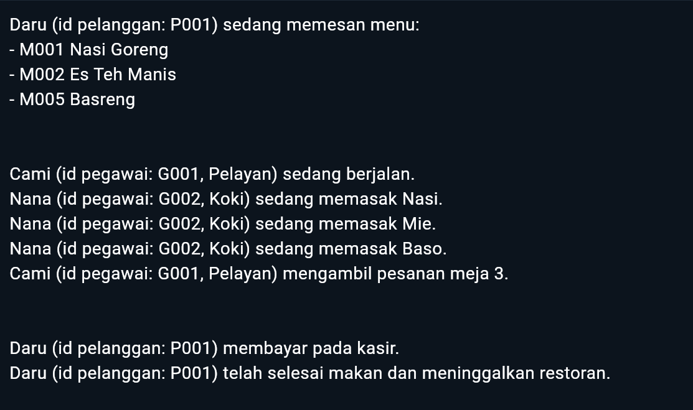
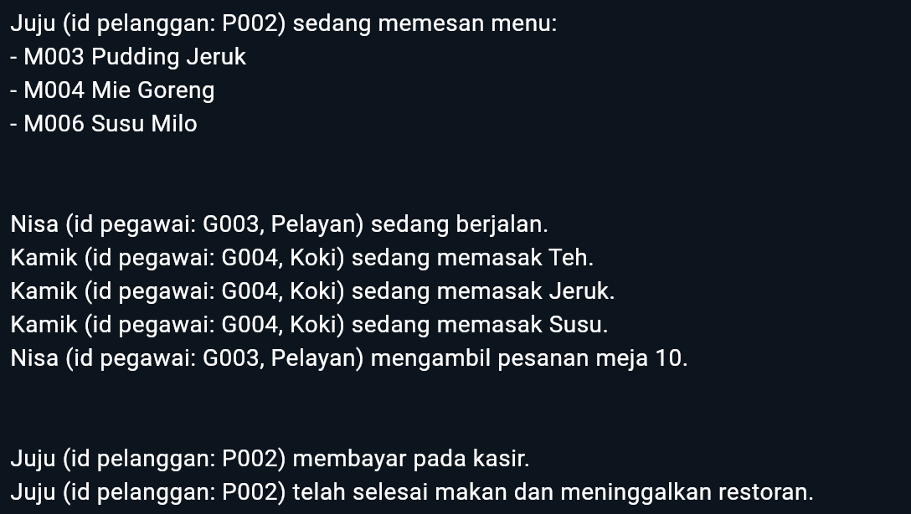

# LP1PROVIS2024C1

## Desain Program
Terdapat 4 kelas dalam prgram ini yaitu : 
* class orang dengan atribut, nama dan jenis kelamin
* class pelanggan dengan atribut, id pelanggan dan nomor meja
* class pegawai dengan atribut, id pegawai dan jenis tugas
* class menu dengan atribut, id menu, nama menu, dan bahan menu

class orang merupakan parent dari class pelanggan dan pagawai.
pelanggan memiliki method yaitu memesan menu, membayar dan selesai makan
pegawai memiliki method yaitu berjalan, mengambil pesanan, menjadi kasir, dan memasak

menggunakan await Future.delayed(Duration(seconds: 2)) untuk menunggu print agar terlihat urutannya.
## output 

